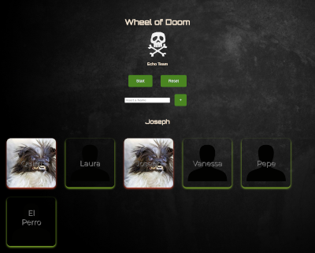
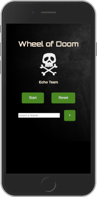

# Wheel of Doom

Project by Echo Team

## Team

- [Quim](https://github.com/Quim79)
- [Carmen ](https://github.com/Carmenprz)
- [Laura](https://github.com/Nau-crc)
- [Joseph](https://github.com/JosephCrespin)
- [vanessa](https://github.com/Quim79)

## Description

La wheel of doom es crear un sistema de selección de sacrificios de manera justa y aleatoria para los coders.
Una vez un nombre sale en la wheel, no puede volver a aparecer hasta que no se reinicie la wheel of doom.

## Screen Shots

## Project Requirements

- HTML, JS y CSS / SCSS (recomendado)
- Código modular.
- arcado HTML semántico.
- Clases CSS reutilizables.
- Código Limpio.
- Foco en UX.
- Mobile first.

## Technologies

- HTML
- Javacript (vanila)
- CSS
- Git

